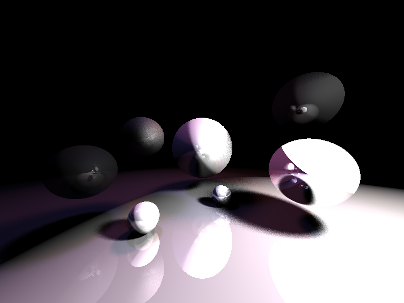

# python-raytracer
Custom raytracer implemented in python. Currently only supports
planes, spheres, and lights.

# Attribution

- [Kyle Halladay's sphere intersection explanation](http://kylehalladay.com/blog/tutorial/math/2013/12/24/Ray-Sphere-Intersection.html)
- [Scratchapixel.com's raytracing explanation](https://www.scratchapixel.com/lessons/3d-basic-rendering/introduction-to-ray-tracing/how-does-it-work)
